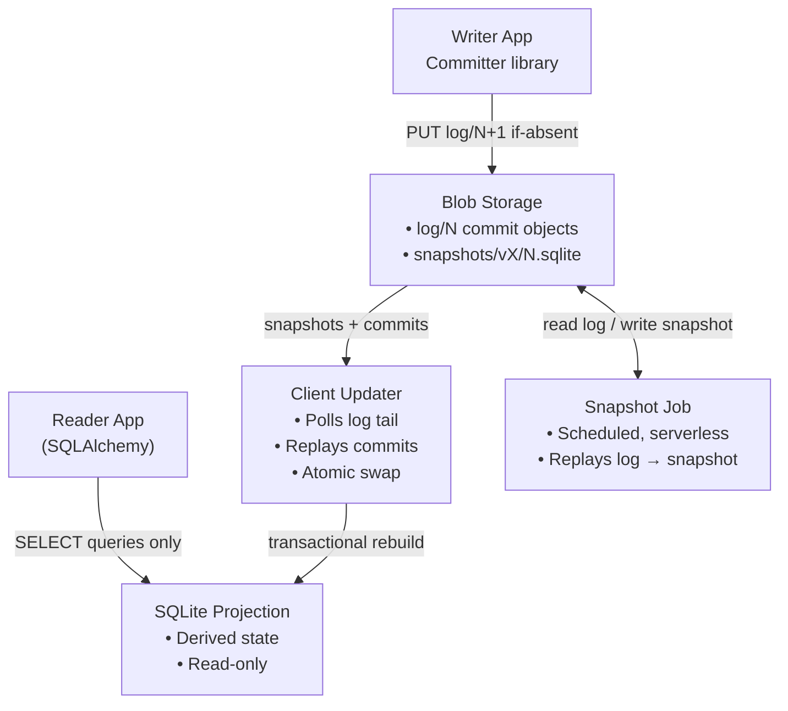

# CairnDB Architecture



No server sits between the writers and the bucket. Each process that holds
credentials and the committer library is a writer. The bucket serializes
the writers.

---

## Storage Layout

All log and snapshot objects are immutable. Reserved prefixes:

```
log/000000000042.msgpack          # root log, commit #42: one msgpack object
                                  # per commit (an ordered batch of events)
snapshots/v1/000000000040.sqlite  # root-log projection state through commit
                                  # #40, for projection schema version 1
logs/{name}/log/…                 # named logs: same layout per log
logs/{name}/snapshots/v1/…        # snapshots of a named log's projections
logs/_tx/log/…                    # the engine's transaction log
txapplied/000000000007            # marker: tx commit #7 applied to objects
```

Names are zero-padded to a fixed width, so lexicographic order equals
numeric order. Every log is *dense*: only a successful put-if-absent
write creates commit N+1, so gaps never occur. Clients discover snapshots
when they list the snapshot prefix. No manifest or pointer object exists.

*Serialization convention* — the wire format is fixed per plane. It is
not pluggable. Control-plane objects (claims, leases, coordination
documents) are canonical JSON, with sorted keys and tight separators, so a
person can inspect and diff them during debugging. The data-plane log is
msgpack, for small size, fast decode on bulk replay, and native binary
payloads. In both planes, timestamps serialize as canonical RFC 3339
(`YYYY-MM-DDTHH:MM:SS.ffffffZ`, fixed width, always UTC).

Consumers of the generic object API (below) can keep key-addressed objects
under any *other* prefix in the same store. The engine rejects application
keys under the reserved prefixes.

---

## Components

### 1. Committer (Writer Library)

The write path is a client library. Any process can embed it: an app, a
scale-to-zero container, or a batch job.

**Commit protocol**

1. Hold the last known commit number N.
2. Serialize the pending batch of events as commit object N+1.
3. Write `log/{N+1}` with put-if-absent
   (S3 `IfNoneMatch="*"`, GCS `if_generation_match=0`,
   Azure `overwrite=False`, filesystem `O_CREAT|O_EXCL`).
4. If the write succeeds, the batch is durable. Acknowledge each event with
   its sequence number `(commit, index)`.
5. If the precondition fails, another writer won N+1. Read the winning
   commits and advance N. Optionally revalidate the batch through the
   application hook. Then retry.

**Group commit**: events submitted while a PUT is in flight accumulate into
the next commit. Callers await a future, and the future resolves only after
the PUT succeeds. This keeps the durable acknowledgement and amortizes
storage round-trips.

**Non-responsibilities**: the committer contains no SQL, reads no
projections, tracks no clients, and pushes no notifications. The committer
is intentionally simple.

### 2. Commit Objects

A commit object is:

- immutable
- an ordered batch of events (`event_type`, effective timestamp, payload,
  event schema version, metadata)
- msgpack-serialized
- the **only write path** in the system

An event's global sequence number is its position: `(commit_number,
index)`. Ordering never depends on wall clocks. Timestamps are
informational only.

### 3. Snapshots

A snapshot is a fully built SQLite database. It represents the projection
through a given commit number. It is stored as an immutable blob under the
prefix of its projection schema version.

A **scheduled batch job** (for example, nightly) produces snapshots.
Building is idempotent and race-safe: replay is deterministic and the
upload is put-if-absent, so duplicate jobs cause no harm. Snapshots bound
client startup time and log-replay length. Snapshots are never diffed. A
snapshot is always rebuilt by replay.

### 4. Client Updater (Reader Library)

Each reading client runs a background updater that:

- bootstraps from the latest snapshot for its schema version, then replays
  the log tail on top
- polls for new commits with a single `GET log/{last+1}` (404 = up to date;
  the dense log makes this exact and cheap)
- applies commits in order, through registered event handlers
- updates the projection with an **atomic swap** (copy → apply → rename),
  so readers never see partial state
- tracks the last applied sequence inside the projection

### 5. SQLite Projection

- local to the client, read-only for application code
- fully derived; deletable and rebuildable at any time
- SQLAlchemy connects read-only (`mode=ro`) and sees a normal SQLite
  database

### 6. Generic Conditional Object Store

`BlobStorage` also exposes the conditional-write machinery directly, for
consumers that need *mutable, etag-guarded documents* next to the
immutable logs. This is the second write primitive of the system. The
engine's coordination layer (`claim`, `lease`, `doc` — see
[ENGINE_API.md](ENGINE_API.md)) is built entirely on it. It is also how
[Flowlet](https://github.com/Quadratic-Labs/flowlet) implements run-state
ownership transfer on blob storage.

- `get_object(key)` → data + current etag
- `put_object(key, data, if_absent=True)` → put-if-absent
- `put_object(key, data, if_match=etag)` → CAS. Returns `None` if the
  object changed or was deleted after the etag was read.
- `delete_object(key)` / `list_objects(prefix)`

Etags are opaque and backend-native: Azure blob etags (`If-Match`), S3
etags (`IfMatch`), GCS generation numbers (`if_generation_match`), and, on
the filesystem backend, content MD5 under a flock-serialized
compare-and-replace. Each method has a synchronous `*_sync` twin — the
primitive form — so synchronous callers do not need an event loop.

The commit log uses only put-if-absent from this API. Log objects stay
immutable.

### 7. Engine Facade

The `CairnDB` facade ([ENGINE_API.md](ENGINE_API.md)) exposes all of the
above. It composes the two write primitives into higher-level machinery and
adds no new storage semantics:

- **Named logs** reroute the commit protocol under `logs/{name}/`, through
  the generic object API. Same Committer, one dense sequence per log.
- **Coordination** (`claim`/`lease`/`doc`) is put-if-absent and CAS on
  documents, with epochs for fencing.
- **Transactions** use a dedicated log (`logs/_tx/`) as the commit point.
  They fold committed mutations into the object store idempotently.
- **Projections** wrap the client updater declaratively, per log.

## Storage

<!-- TODO -->
### Cost Model

- Write: 1 conditional PUT per commit (group commit batches events).
- Read poll: 1 GET per interval per client (404 when idle) — cents/month.
- Snapshot job: a scheduled serverless container, minutes per day.
- No idle compute anywhere. Storage is the only always-on cost.

The throughput ceiling is one commit per storage round-trip (approximately
10–30 commits per second) *per log*, multiplied by group-commit batching.
This is a deliberate trade-off. Named logs are the sharding mechanism when
one log's ceiling is exceeded.
