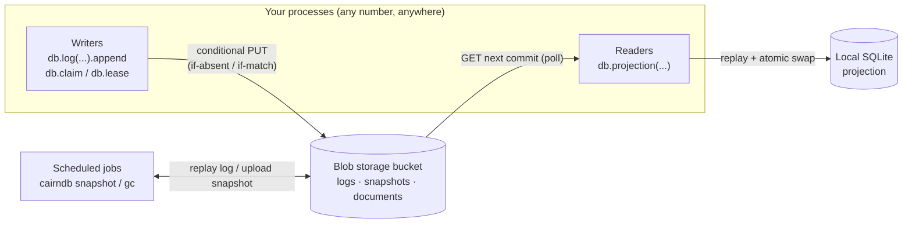

# Concepts overview

CairnDB has no server that coordinates writers. Concurrent processes
cooperate through **conditional writes** to a shared bucket, and the
storage backend accepts or rejects each conditional write atomically.
That one mechanism is enough to build the usual parts of a database
engine: a write-ahead log, atomic writes, transactions, uniqueness
constraints, locks, indexes, and materialized views.

CairnDB exposes each part as a client-library primitive, stacked in
layers:

| Layer | Primitive | Engine analogy |
|---|---|---|
| 0 | [Conditional objects](objects.md) (`db.objects`) | atomic page writes |
| 1 | [Coordination](coordination.md) (`claim`, `lease`, `doc`) | unique constraints, row locks, read-modify-write |
| 2 | [Logs](logs.md) (`db.log`) and [transactions](transactions.md) (`db.transact`) | WAL, transaction coordinator |
| 3 | [Projections](projections.md) (`db.projection`) | indexes, materialized views |
| 4 | Lifecycle and watch (`wait_for`, `tail`, [scheduled jobs](../guides/operations.md)) | vacuum, change feeds |

## The big picture

1. **Writers** append events. Each write batch becomes an immutable,
   numbered commit object. The bucket accepts exactly one writer per
   number (put-if-absent), so each log is dense, gap-free, and totally
   ordered, with no clocks and no sequencer service. Coordination
   documents use the same machinery with etags (compare-and-swap).
2. **Readers** replay commits through registered handlers into a local
   SQLite file. They swap it atomically, so readers never see partial
   state.
3. **Scheduled jobs** replay the log into snapshot files that bound
   client startup time. Garbage collection prunes what snapshots cover.
   Nothing outside the bucket needs to survive.

## Mental model

- Blob storage is the ledger, the sequencer, and the lock manager.
- There are two write primitives: **put-if-absent** (logs, claims) and
  **compare-and-swap** (documents, leases).
- Commits are the truth. The acknowledgement follows the PUT, never
  precedes it.
- Snapshots are checkpoints.
- SQLite is a cache, and SQLAlchemy is only a reader.
- Replay fixes everything.

## Where to read next

- [Storage model](storage-model.md): the bucket layout, serialization,
  and the invariants every layer relies on.
- [Guarantees and limits](consistency.md): the consistency model, costs,
  throughput ceilings, and non-goals, on one page.
