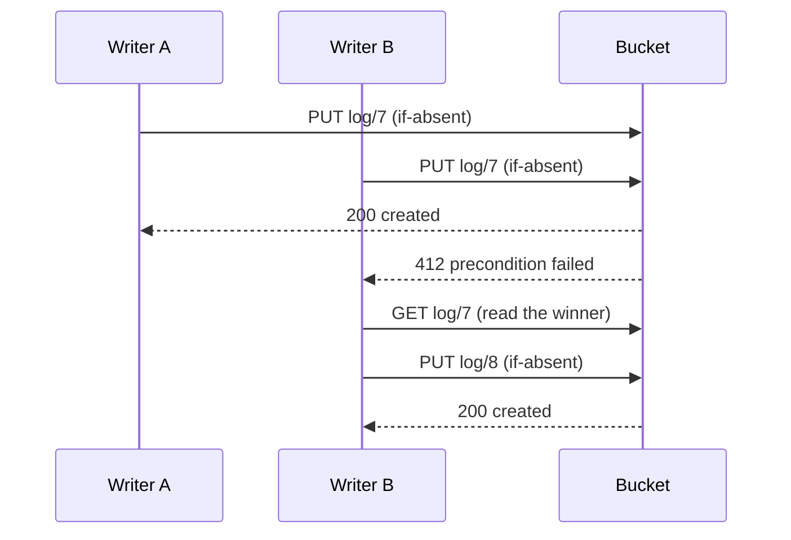

# Layer 2 — Logs

A log is a sequence of immutable **commit objects** with a dense, total
order: commit N+1 exists only after commit N, and gaps never occur. Each
commit holds an ordered batch of events. Logs are CairnDB's write-ahead
log, and the source of truth for everything [projections](projections.md)
derive.

```python
orders = db.log("orders")          # a named log
root   = db.log()                  # the root log (layout: log/ + snapshots/)

seq  = await orders.append(event)              # durable once returned
seqs = await orders.append_many([e1, e2, e3])  # relative order preserved

async for entry in orders.read(after=0):       # replay up to the current tail
    ...
async for entry in orders.tail(poll_interval=1.0):   # follow forever
    ...
last = await orders.current_tail()             # highest commit number (0 = empty)
```

## Events

An {class}`~cairndb.Event` is an immutable fact:

| Field | Type | Meaning |
|---|---|---|
| `event_type` | `EventType` (str) | what happened, e.g. `"order.placed"`; selects the projection handler |
| `timestamp` | `Timestamp` | *effective* time, informational only; ordering never depends on it |
| `payload` | `dict` | the data; msgpack-serializable (bytes are fine) |
| `schema_version` | `SchemaVersion` (str) | version of this event type's payload shape |
| `metadata` | `dict` | optional: correlation ids, actor, source, … |

Events carry no sequence number of their own. An event's position is its
{term}`sequence number` `(commit, index)`: the commit it landed in, and
its index within that commit. Readers receive events as
{class}`~cairndb.SequencedEvent`, which exposes the event fields directly
(`entry.payload`, `entry.event_type`, …) plus `entry.sequence`.

The canonical string form, `000000000042:000003`, sorts
lexicographically in the same order as numerically. That makes it safe to
store and compare as text.

## The commit protocol

Every writer, in any process, runs the same protocol. There is no
sequencer process: the bucket's put-if-absent arbitration sequences each
log.

1. Hold the last known commit number N.
2. Serialize the pending batch of events as commit object N+1.
3. Write `log/{N+1}` with **put-if-absent**.
4. If the write succeeds, the batch is durable. Resolve each event's
   `append()` with its sequence number.
5. If the precondition fails, another writer won N+1. Read the winning
   commits, advance N, optionally
   [revalidate](#revalidation-invariants-across-writers) the batch, and
   retry.



A "zombie" writer with a stale view of the log can never overwrite
anything. Its PUT targets a number that already exists, and the storage
rejects it.

### Group commit

Events appended while a PUT is in flight accumulate into the next commit.
Callers await a future that resolves only **after** the PUT succeeds. So
batching amortizes storage round-trips without weakening the durable-ack
guarantee. Tune batching through {class}`~cairndb.CommitterConfig`
(`max_events_per_commit`, `max_batch_wait_seconds`) when you use the
[lower-level API](../guides/lower-level-api.md).

### Revalidation: invariants across writers

Most events are pure facts ("user 42 clicked"), and their validity does
not depend on other writers. Some carry invariants that a concurrent
writer could break: "username is unique", "balance stays positive". For
those, the committer accepts a **revalidate hook**. After a lost race, the
hook receives the pending events and the commits that interleaved. It
returns, for each event, the event to commit (possibly modified), or
`None` to reject it. A rejected event fails its `append()` with
`EventRejectedError`.

The [transaction layer](transactions.md) uses exactly this mechanism for
conflict detection. See [Lower-level API](../guides/lower-level-api.md#revalidate-hooks)
for how to wire a hook.

## Named logs and sharding

Ordering is total **within** a log, never across logs. Each named log has
its own dense sequence, its own throughput budget, and its own snapshots:

```text
logs/orders/log/000000000001.msgpack
logs/orders/snapshots/v1/000000000500.sqlite
```

Log names must match `[a-z0-9._-]+`. The root log (`db.log()`) keeps the
original `log/` + `snapshots/` layout.

**Sharding across named logs is the scaling mechanism.** One log sustains
roughly one commit per storage round-trip, typically 10–30 commits per
second, multiplied by the events batched into each commit. Give
independent domains their own logs, such as `orders`, `inventory`, and
`audit`, and they no longer share that budget.

## Reading and following

- `read(after=N, end_at=M)` yields events from commits > N up to the
  current tail (or M), then stops.
- `tail(after=N, poll_interval=s)` never stops. In the steady state it
  costs one `GET log/{next}` per interval, and a 404 means "idle". Break
  out of the loop to stop.
- `read_commits(...)` is the same as `read`, at commit granularity.

Because the log is dense, "is there anything new?" is a single GET of the
next number. It needs no listing, no index, and no notification service.
