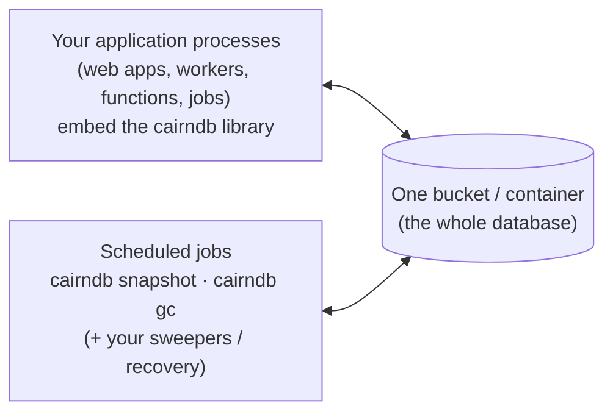

# Deployment overview

A CairnDB deployment has **no database server**. It has three parts:



1. **A bucket**: S3, GCS, Azure Blob, or a local directory. It holds all
   state.
2. **Your processes**: anything that runs Python 3.14 and can reach the
   bucket. They write and coordinate through the library, and keep their
   own local projection files.
3. **Scheduled jobs**: the snapshot and GC jobs, plus optionally
   transaction recovery and your sweepers. They are short-lived containers
   on a cron schedule.

Nothing is resident, so scale-to-zero platforms are a natural fit:
serverless containers, functions, and batch jobs.

## Choosing a storage backend

| Backend | Use for | Notes |
|---|---|---|
| `filesystem` | development, tests, single-machine deployments | POSIX only (`flock`, atomic `os.link`); a faithful concurrency simulator for tests |
| `s3` | AWS | native conditional writes (`If-None-Match`, `If-Match`) |
| `gcs` | Google Cloud | generation preconditions |
| `azure` | Azure | etag conditions; hierarchical-namespace (ADLS Gen2) accounts supported |
| `s3` + `endpoint_url` | MinIO, Cloudflare R2, other S3-compatible stores | **must** support conditional writes; verify before production |

:::{danger}
**Conditional writes are not optional.** CairnDB's ordering, uniqueness,
and fencing guarantees all rest on the backend honouring put-if-absent
and compare-and-swap atomically. An S3-compatible store that accepts
`If-None-Match` but ignores it corrupts logs *silently*. Test it: two
concurrent `put(..., if_absent=True)` calls on the same key must yield
exactly one success.
:::

## Credentials and permissions

Every process that uses CairnDB needs read, write, list, and delete
access to the bucket, or to its prefix. Nothing more.

| Backend | Authentication | Minimum permissions |
|---|---|---|
| S3 | boto3's default chain (env vars, profile, instance/task role) | `s3:GetObject`, `s3:PutObject`, `s3:DeleteObject`, `s3:ListBucket` |
| GCS | Application Default Credentials, or `credentials_path` (service-account key) | `roles/storage.objectUser` on the bucket |
| Azure | `connection_string`, or `account_url` + `DefaultAzureCredential` (managed identity, CLI login, …) | `Storage Blob Data Contributor` on the container or account |

Anyone who can write to the bucket can write to the database. Grant
access accordingly, and prefer workload identities over long-lived keys.

## Configuring processes

In code:

```python
db = CairnDB.configure({"storage": {"type": "s3", "bucket": "myapp", "region": "eu-west-1"}})
```

Or from the environment, which is what the CLI jobs use:

```bash
CAIRNDB_STORAGE_TYPE=s3
CAIRNDB_S3_BUCKET=myapp
CAIRNDB_S3_REGION=eu-west-1
```

See [Configuration](../reference/configuration.md) for every option.

## The jobs image

The repository's `Dockerfile` builds a small image with the `cairndb` CLI
as its entrypoint and all backends installed. The snapshot job must
import **your** handlers, so build an application image on top of it:

```dockerfile
FROM cairndb-jobs:latest
USER root
COPY . /src
RUN pip install --no-cache-dir /src
USER cairndb
# The entrypoint is `cairndb`; pass the job as arguments, e.g.:
# snapshot --handlers myapp.projections:registry [--log orders]
```

Build the base image with `docker build -t cairndb-jobs .` from the
repository root.

## Production checklist

- [ ] The backend enforces conditional writes (tested, not assumed).
- [ ] Bucket versioning or soft delete is on. Replicate across regions if
      you need to.
- [ ] No lifecycle or expiry rules on `log/`, `logs/`, `snapshots/`, or
      `txapplied/`.
- [ ] A snapshot job is scheduled per log that has a projection (`--log`),
      with `--schema-version` equal to the projection's `version` if you
      changed it from the default.
- [ ] A GC job is scheduled, and `--prune-log` is a deliberate decision.
- [ ] `db.recover_transactions()` runs at startup or on a schedule, if you
      use transactions.
- [ ] Lease ttls are generous relative to step durations and clock skew.
- [ ] Logs are shipped somewhere, and failed jobs alert someone.

## Platform guides

- [Local and self-hosted](local.md): the filesystem backend, MinIO,
  Docker, cron, and systemd timers.
- [AWS](aws.md): S3, with ECS/Fargate scheduled tasks or Lambda.
- [Google Cloud](gcp.md): GCS, with Cloud Run jobs and Cloud Scheduler.
- [Azure](azure.md): Blob Storage and Container Apps jobs, with the
  Bicep templates shipped in `infra/`.
